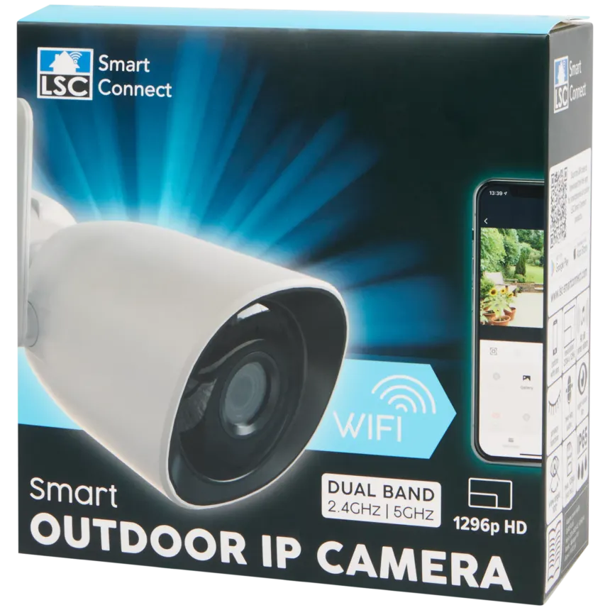

# LSC Action Camera H.264 / 1920 Hack

This project was tested on the **LSC Action camera** running firmware
**V6.2023.126.1351**. The tested device is the **H.265 / 1296** version.

The exact version I have is **3202092.4**.

## Goal

The original goal was to switch the camera from H.265 / 1296 to **H.264 /
1920** in order to reduce CPU usage on the receiving side.

To do that, the camera hardware settings need to be overridden through
`_ht_hw_settings.ini`.

## Important Prerequisite

The camera must already have been paired with Wi-Fi through the **Tuya app**
before using this hack.

## Required Files

All files in this repository are required. If even one file is missing, the hack
stops working.

In particular, `hostapd` and `cgi-bin/main.cgi` appear to be required, although
I have not been able to determine exactly why they are mandatory.

## RTSP Note

Ideally, I wanted to use RTSP. Enabling RTSP is fairly easy, but I ran into a
timezone issue that I was never able to solve reliably.

Because of that, this repository focuses on the `_ht_hw_settings.ini` override
approach instead.

## Inspiration

This work was inspired by:

- [HeartyGFX/LSC-Anyka-RTSP-Hack](https://github.com/HeartyGFX/LSC-Anyka-RTSP-Hack)
- [tasarren/lsc-tuya-toolkit](https://github.com/tasarren/lsc-tuya-toolkit/)
- [guino/LSCOutdoor1080P](https://github.com/guino/LSCOutdoor1080P/)

## Disclaimer

This is an experimental camera hack. Use it at your own risk.
